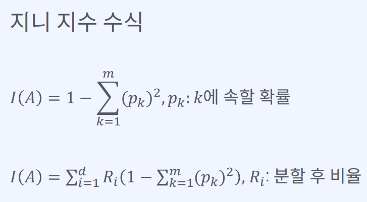

# 오전

- ## 분류

  - 학습데이터로 주어진 데이터의 피쳐와 레이블값을 머신러닝 알고리즘으로 학습해 모델을 생성하고 이렇게 생성된 모델에 새로운 데이터 값이 주어졌을 때 미지의 레이블이 주어지는 것
  - [OCR](https://namu.wiki/w/OCR)
  - 이진 분류기
    - 입력된 데이터를 두 그룹(참,거짓)으로 분류하는 것
  - 오차행렬
    - 레이블별 예측 결과를 정리한 행렬
    ```
    TN|FP
    FN|TP
    ```
    - 모델 사용 목적에 따라 정확도와 재현율의 중요가 다를수 있음
    - 재현율 > 정밀도 : 암진단기준
    - 정밀도 > 재현율 : 아동용 동영상 선택기준
  - ROC 곡선

    - roc곡선을 이용하여 이진 분류기의 성능을 측정할 수 있음
    - 거짓 양성 비율에 대한 참 양성 비율의 관계를 나타내는 곡선임
    - 그래프 해석 : y=x, 50% 확률로 찍음 / 왼쪽위 벽을 타고 올라가면 완벽하게 예측 / 오른쪽 아래 벽을 타면 완벽히 반대로 예측(결과를 반대로 해석하면 우수한 모델과 비슷한 결과를 가져옴)

  - AUC

    - recall은 높게, 거짓양성비율은 낮게 유지할수록 좋은 분류기
    - roc커브가 y축에 최대한 근접해야하고 roc커브 아래 면적 즉 auc가 1에 가까울수록 좋은 성능임을 나타냄

  - 다중클래스분류

    - 세개 이상의 클래스로 데이터를 분류하며 다항 분류라고도 불린다.
    - 클래스가 세개 이상이 되면 대상과 나머지로 각각 사례를 나누어 생각해야함

  - ## 결정트리

  - 결정트리는 매우 쉽고 유연하게 적용될 수 있는 알고리즘
  - 하이퍼 파라미터

  - max_depth : 아래로 얼마나 뻗어갈거냐
  - min_samples_split : 노드 분할해 필요한 최소 샘플 개수
  - min_sample_leaf : 리프에 포함된 최소 샘플 개수
  - min_weight_fraction_leaf : 샘풀 가중치 합의 최솟값
  - max_leaf_nodes : 최대 리프 개수
  - max_features : 분할에 사용되는 특성 개수

  - 값

  - gini : 해당 노드의 지니 불순도 측정값 => 지니 불순도란 분류 데이터가 얼마나 섞여 있는지를 나타낸다

  ```
  불순도를 측정하는 지니
  - 결정트리의 분리가 잘 된 것을 평가하기 위한 지표
  - 0에 가까울수록 해당 클래스에 섞인 다른 클래스의 양이 적음을 의미
  ```

  

  - samples : 해당 노드에 속하는 샘플 수
  - value : 해당 노드에 속하는 샘플들의 실제 클래스별 개수
  - class : 각 클래스별 비율을 계산하여 가장 높은 비율에 해당하는 클래스 선정

  - 장단점

  - 장점 : 쉽고 직관적, 데이터 가공의 영향도가 크지 않다
  - 단점 : 과적합으로 성능이 떨어질 수 있다(규제필요)

  - ## KNN 알고리즘
  - 주변 데이터를 살펴본뒤 더 많은 데이터가 포함되어 있는 클래스로 분류하는 방식. => 일정 거리안에서 가장 가까운 이웃이 누구인가
  - K의 개수만큼 주변의 데이터를 살펴본다는 뜻
  - 배치로 생각하기 때문에 test, train의 개념이 없음.
  - 라벨링이 되어 있기 때문에 클러스터링이 아닌 분류에 들어감.
  - 유클리드 거리를 통해 최소 거리를 계산

  ***

# 오후

- ## 분류알고리즘

- 편향과 분산
  - 편향 : 예측값과 정답이 떨어져 있는 정도(유클리드 거리) / 정답에 대한 잘못된 가정으로부터 유발되며 편향이 크면 과소적합이 발생
  - 분산 : 입력 샘플의 작은 변동에 반응하는 정도 / 정답에 대한 너무 복잡한 모델을 설정하는 경우 분산이 커지며, 분산이 크면 과대적합이 발생
- 앙상블 학습과 랜덤 포레스트

  - 앙상블 학습(보팅, 배깅, 부스팅)
  - 여러 개의 분류기를 생성하고 그 예측을 결합함으로써 보다 정확한 예측을 도출하는 기법
  - 강력한 하나의 모델을 사용하는 대신 약한 모델 여러 개를 조합하여 더 정확한 에측에 도움을 주는 방식

  ```
  [보팅]
  - 여러 개의 분류기가 투표를 통해 최종 에측결과를 결정하는 방식
  - 서로 다른 알고리즘을 여러 개 결합하여 사용
  - 하드보팅 : 다수의 분류기가 예측한 결과값을 최종 결과로 선정
  - 소프트보팅 : 모든 분류기가 예측한 레이블 값의 결정 확률 평균을 구한 뒤 가장 확률이 높은 레이블 값을 최종 결과로 선정
  ```

- 배깅(훈련이 병렬화)

  - 데이터 샘플링을 통해 모델을 학습시키고 결과를 집계하는 방법
  - 모두 같은 유형의 알고리즘 기반의 분류기를 사용
  - 예측값의 최빈값을 최종 예측값으로 선택
  - 대표 배깅 방식 : 랜덤포레스트 알고리즘
  - 중복허용/ 각각 샘플링을 할때 중복을 혀용하여 무작위로 뽑아서 뿌림

- 랜덤 포레스트

  - 배깅 기법을 결정트리의 앙상블에 특화시킨 모델

- 부스팅(훈련이 직렬화 - 시간이 오래 걸림)

  - 여러 개의 분류기가 순차적으로 학습을 진행
  - 이전 분류기가 에측이 틀린 데이터에 대해 올바르게 예측할 수 있도록 다음 분류기에게 가중치를 부여하면서 학습과 예측을 진행
  - 계속하여 분류기ㅇ게 가중치를 부스팅하며 학습을 진행하기에 부스팅 방식이라고 불림
  - 순차적으로 학습하기에 배깅 방식과는 달리 훈련을 동시에 진행할 수 없으므로 훈련시간이 오래걸림
  - 에이다 부스트(결과를 보면서 추세선에서 벗어난 값에 가중치를 주며 추세선을 모델에 적합시킴)
  - 그래디언트 부스팅(이전 모델의 예측에 오차가 있다면 그 오차를 보정하는 새로운 예측기를 새롭게 훈련/에이다부스트 기법은 샘플의 가중치를 조정하는 반면, 그래디언트 부스팅기법은 이전 에측이에 의해 생성된 장차에 대해 새로운 예측기를 학습시킨다)

- 스태킹

  - 배깅방식의 응용
  - 다수결을 이용하는 대신 여러 예측값을 학습데이터로 활용하는 예측기를

- ## 보고서 작성팀

  - 데이터에 대한 설명(컬럼), 전처리법(ex. 당뇨병에서 당뇨인 기준을 대한의사협회에서 쓰는 기준을 썻던 것을 언급)
  - EDA한 자료 보여주기
  - 개선한 결과를 넣을 수 있으면 넣어서 돌리기
  - 보고서 내에서 데이터를 보여주고 싶으면 캡쳐해서 올리는 것이 아니라 엑셀로 만들어서 참조라고 쓰기
  - 코드를 캡쳐하는 것이 아닌 자세하게 풀어서 작성(보여주고 싶으면 깃허브에 올려서 작성)
  - 이미지는 줄이기만 하기, 가급적 늘리지 말자

  **천재교육 이념 : 사교육이 공교육에서 하지 못하는 것을 보완해야한다**

- ## 회귀

  - 회귀

    - 현대 통계학을 이루는 큰 축
    - 회귀 분석은 유전적 특성을 연구하던 영국의 통계학자 갈톤이 수행한 연구에서 유래했다는 것이 일반론
    - 데이터의 값은 모평균으로 회귀하려는 경향이 있다
    - 회귀는 여러개의 독립변수와 한개의 종속변수 간의 상관관계를 모델링하는 기법을 통칭

  - 회귀의 유형

    - 다중선형회귀

    ```
    독립변수의 개수  | 회귀 계수의 결합
    --------------------------------------
    1개:단일회귀     | 선형:선형회귀
    2개이상:다중회귀 | 비선형 : 비선형회귀
    ```

    - 단순선형회귀
      - 최적의 회귀모델을 만들다는 것 : 전체 데이터의 잔차합이 최소가 되는 모델을 만든다는 의미

  - MSE => 최소가 되도록 하는 파라미터를 찾는 것이 최종목표
  - RMSE
  - 경사하강법
    - cost function : 오차를 대변하는 수치
    - 적당히 간격을 두고 편미분을 해야함(기울기를 0으로 만드는 것이 목표)
    - 주의사항
      - 스텝을 너무 작게 잡으면 학습을 너무 오래함
      - 그래프가 변곡이 많은 곡선인 경우, 기울기가 0인 값중 가장 작으면 전역 최솟값, 단순히 기울기가 0이면 지역 최솟값. => 스텝이 너무 작으면 0인경우를 찾아서 전역 최솟값을 찾기 전 멈춰버림
      - 스텝이 너무 크면 발산을 해버림
    - 종류(배치크기(파라미터를 업데이트하기 위해 사용되는 학습데이터의 개수)에 따라)
      - 용어정리
        - 배치사이즈
        - 에포크(전체학습을 돌리는 수)
        - 스텝
      - 배치 경사하강법 : 전체 학습데이터셋 크기와 같은, 즉 스텝이 1번 발생하는 경사하강법
      - 확률적 경사하강법
