# 머신러닝 모델 구현 및 분석 보고서

## 회원별 상태변화일자 예측모델

###### 빅데이터 9기 전동인

---

### 목차

1. [문제정의](#1-문제정의)
2. [데이터설명](#2-데이터-설명)
3. [데이터 탐색](#3-데이터-탐색)
4. [전처리](#4-전처리)
5. [EDA](#5-eda)
6. [아이디어](#6-아이디어)
7. [모델선정](#7-모델선정)
8. [결론](#8-결론)

---

### 1. 문제정의

- **상황**

  - 대상 : 초등학교 5학년은 학생들이 학습의 난이도도 올라가고 중학교에 가기 전 필요한 공부를 한창 실시하는 학년이다. 즉 중학교에 대한 선행과 학년에서 배우는 내용에 대한 공부가 철저하게 이루어지는 시기이다.

  - 회원의 상태가 변화했을때 그 회원의 상태를 구독상태로 유지시키는 것이 중요하다. 만료는 잠재적으로 다른 서비스로 이동하여 탈퇴를 할 수 있는 상태이고 탈퇴는 손실로 오게된다.

* **방향**

  - 학생이 콘텐츠를 사용하는 특징에 따라 어느정도 기간을 유지 후 회원상태가 바뀌는지에 대한 예측모델을 만들어보고자 한다.

* **인사이트를 도출해야 하는 이유**
  - 지속해서 서비스를 이용할 수 있게 하는 요인에는 여러가지가 있겠지만 제공되는 학습을 학생들이 어떻게 이용하는지에 대한 지표도 중요할 것이다. 아무리 좋은 강의라도 학생이 시청하고 성적 향상이 있을 때 의미가 있는 것인데 그런 의미에서 상태변화일을 늦출 수 있는 요인으로 학생들의 학습패턴이 어떻게 작용하는지 보고자한다.

### 2. 데이터 설명

- 데이터셋 : 천재교육 서비스 내 회원별(초등학교 5학년) 활동정보
- 형태
  - 학생 정보 : 6476
  - Feature : 45
- [컬럼](./Data_explain.md) : 별첨자료에서 제시

### 3. 데이터 탐색

---

- #### 중복값 : 없음

  - userid에서 동일한 id가 발생. 총 30종류의 id가 존재했고 이는 해당 데이터셋에 존재하는 학생이 총 30명이라는 것을 알 수 있다.

- #### 결측치 : 없음

### 4. 전처리

---

- #### userid_stu열 추가

  - 사유 : userid는 시각화를 했을때 식별하기 어려운 상태라 stu_1~stu_30으로 30명의 학생을 새롭게 처리

- #### object_type 자료형 변환

  - 해당 feature은 영상을 보았는지, 디지털 서비스를 이용했는지 웹페이지를 이용했지에 대한 구분을 하는데 string 형태로 되어 있어서 각각 숫자로 변환
    - DigitalResource => 2
    - VideoObject => 1
    - WebPage => 0

- #### event_type 자료형 변환

  - 해당 feature은 학생이 어떤 방식으로 콘텐츠를 이용했는지를 구분하는데 string 자료형이기에 숫자로 바꿈.
    - MediaEvent => 2
    - NavigationEvent => 1
    - ViewEvent => 0

- #### mcode 자료형 변환

  - mcode는 학생이 이용한 콘텐츠를 구분하는 정보이다. userid와 비슷한 개념으로 학생이 아닌 콘텐츠를 구분하는 역할을 한다. string 자료형으로 정리되어 있기에 랜덤하게 숫자를 지정하여 각 코드에 맞게 매핑을 하여 int형으로 변환하였다.

- #### 시간차이열 추가
  - 해당 데이터에 시간을 나타내는 것은 년월일시분초로 나타나있는데 실제 학생이 콘텐츠별 어느정도 시간을 투자하는지를 초단위로 보기위해 time_diff_seconds라는 열추가. 같은 학생의 콘텐츠별 시작 시간과 끝나시간의 차이를 구하여 지정.
  - 해당 열에서 양수 이외의 0이나 음수가 등장하는데 확인 결과 당일 콘텐츠를 종료하지 않고 다음날 계속되어 진행되는 경우 이를 뺏을 때 0이나 음수가 나타나는 것을 확인

### 5. EDA

---

- ## 학생별 활동량

  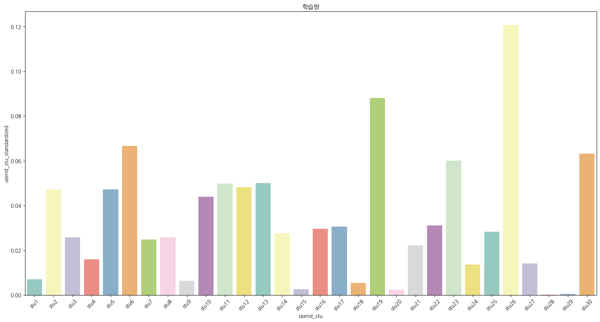

  - 총 학생은 30명이기에 일치하는 userid를 카운트하면 학생이 서비스를 어느정도 사용했는지를 볼 수 있다. 이를 비율로 바꾸어 시각화를 하였다. 이 지표가 실제 학생이 공부를 성실하게 임했다는 지표로 사용하기는 어렵지만 stu26이 가장 많은 활동을 하였고 대체로 0.05정도의 활동량이 있음을 알 수 있다.

- ## 학생별 활동량 + object_type

  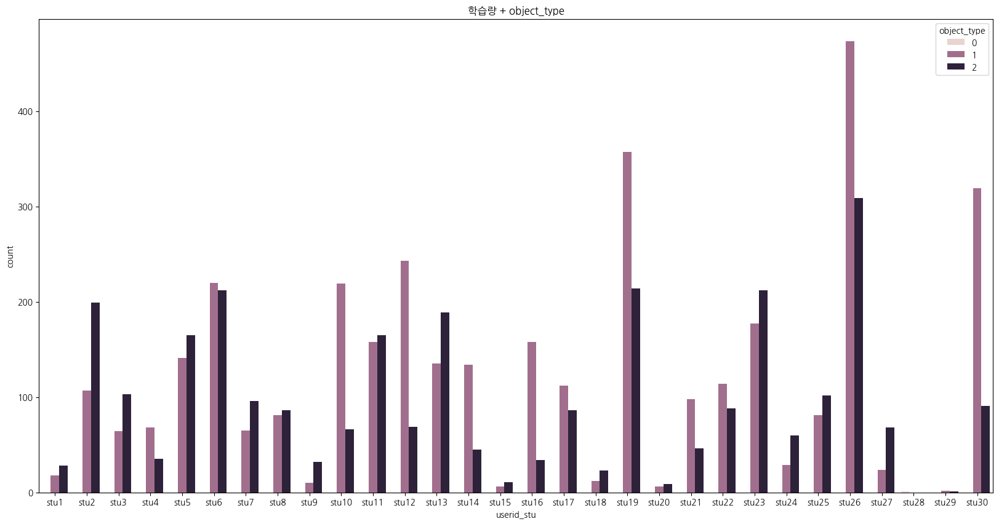

  - 앞서 학생별 활동량을 object_type에 따라 시각화를 해보았다. 학생별 활동량 그래프에서 활동량이 많다고 나온 학생은 영상 시청에서 많은 활동을 하였고 디지털 서비스 이용도 존재하는 것을 볼 수 있다. 웹페이지를 이용한 학생은 극히 드문것을 볼 수 있다. 즉 영상을 조작하는데 있어서 많은 활동량을 보여주고 실제 웹페이지는 적게 이용한다는 것을 알 수 있다.

- ## 콘텐츠별 투자한 시간
  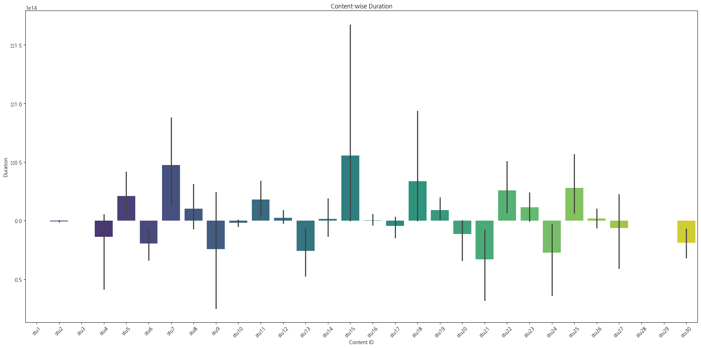
  - 앞선 학생별 활동량과는 상이한 결과가 나왔는데 가장 많은 활동량이 많았던 stu26학생은 활동 시간으로 본다면 거의 0에 수렴하는 것을 볼 수 있다. 즉 콘텐츠를 많이 이용해서 활동량이 높은 것이 아닌 실제 일시정지, 넘기는 등 한 콘텐츠 내에서 학생의 활동이 많아서 나온 결과로 추측된다. 시간으로 친다면 stu15의 시간이 가장 긴것을 볼 수 있다.

### 6. 추가적인 전처리

---

- 필요성 : 학생들의 활동량이 매우 편향적인 것을 볼 수 있다. 서비스를 활용한 카운트 값이기에 특정 학생에 값이 치중되어 있는데 치중된만큼 상태 변화일 수에 영향을 주기 때문에 자료를 정규성에 맞게 변환하는 작업을 해보았다.

- 변환 :

  - 로그 변환

    - 그래프
      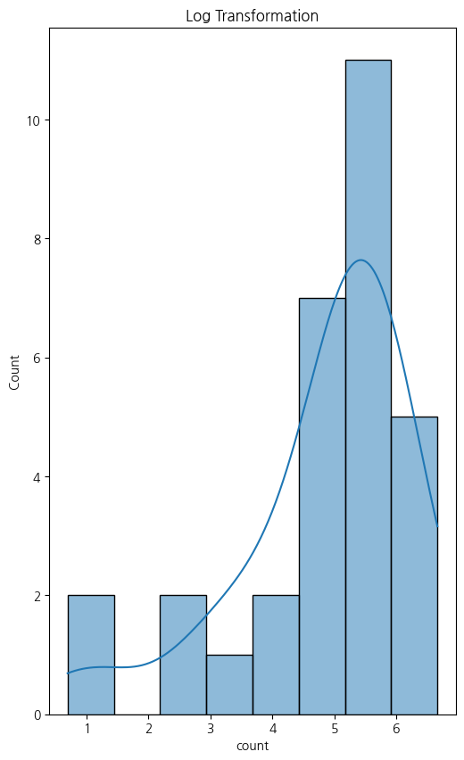
    - qqplot
      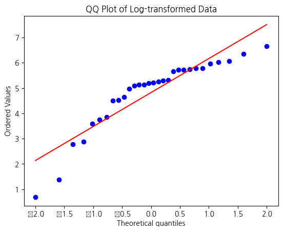

  - 박스콕스 변환

    - 그래프
      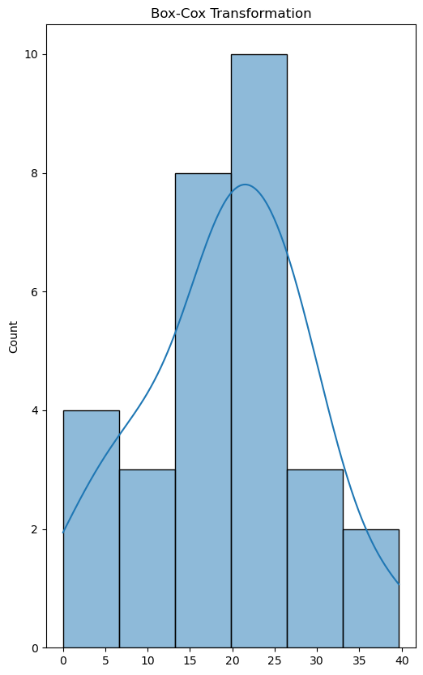
    - qqplot
      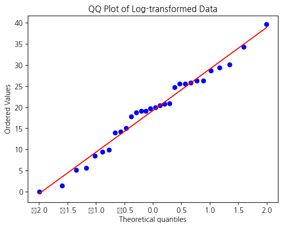

  - 박스콕스 변환이 로그 변환에 비해 정규성을 띈다고 볼 수 있고 boxcox_count라는 열을 새로 만들어 변환된 값을 추가하였다

### 7. 아이디어

---

- **학생 학습 태도별 상태기간 예측모델** : change_date에선 일자를 볼 수 있는데 예를들어 26이라면 26일만에 학생의 구독 상태가 바뀌었다는 것을 의미한다. 즉 이 숫자가 클수록 구독을 오래했다는 유지한다는 의미이고 작을수록 상대적으로 일찍 구독 상태가 바뀌었다는 것을 알 수 있다. 즉 이 change_date의 값에 영향을 줄 수 있는 요인으로 예측모델을 만들어 어떻게 하면 구독을 오래 유지할 수 있을지 알아보고자 한다.

### 8. 모델선정

---

- X,y 선정

  - X : "learning_action_seq", "learning_seq", "event_type", "object_type", "mcode_mapped","time_diff_seconds","boxcox_count"

    - 필요한 feature은 이렇게 지정함. 전처리 과정에서 string type을 int형으로 구분하였고 실제 학습 방식와 관련이 있는 feature만 골라내어 X로 생성

  - y : change_date열을 y로 지정

- 모델

  - AdaBoostClassifier, RandomForestClassifier을 활용하여 성능을 비교하고 유의미한 feature_importaces 찾아보고자 한다.

  - **AdaBoostClassifier**

    - n_estimators=1000
    - 결과

      - score
        - train : 0.42
        - test : 0.43
      - feature_importaces

        ***

        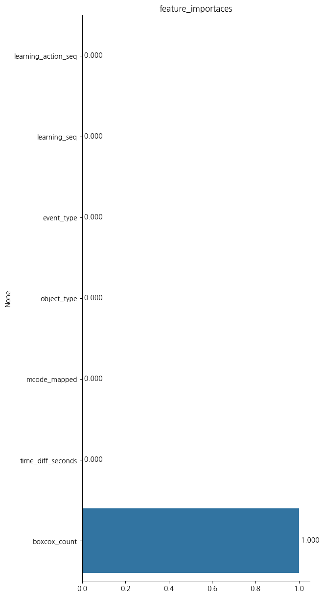

        - boxcox_count가 1.0인데 매우 편향적인 것을 알 수 있고 해당 feature만 보고 예측한 것으로 해석된다

      - confusion_marix

        

        
        <table border="1" class="dataframe">
        <thead>
            <tr style="text-align: right;">
            <th></th>
            <th>0</th>
            <th>1</th>
            <th>2</th>
            <th>3</th>
            <th>4</th>
            <th>5</th>
            <th>6</th>
            <th>7</th>
            <th>8</th>
            <th>9</th>
            <th>10</th>
            <th>11</th>
            </tr>
        </thead>
        <tbody>
            <tr>
            <th>0</th>
            <td>0</td>
            <td>54</td>
            <td>0</td>
            <td>0</td>
            <td>0</td>
            <td>0</td>
            <td>0</td>
            <td>0</td>
            <td>0</td>
            <td>0</td>
            <td>0</td>
            <td>0</td>
            </tr>
            <tr>
            <th>1</th>
            <td>0</td>
            <td>230</td>
            <td>0</td>
            <td>0</td>
            <td>0</td>
            <td>0</td>
            <td>0</td>
            <td>0</td>
            <td>0</td>
            <td>0</td>
            <td>0</td>
            <td>0</td>
            </tr>
            <tr>
            <th>2</th>
            <td>0</td>
            <td>0</td>
            <td>104</td>
            <td>0</td>
            <td>0</td>
            <td>0</td>
            <td>0</td>
            <td>0</td>
            <td>0</td>
            <td>0</td>
            <td>0</td>
            <td>0</td>
            </tr>
            <tr>
            <th>3</th>
            <td>0</td>
            <td>76</td>
            <td>83</td>
            <td>0</td>
            <td>0</td>
            <td>0</td>
            <td>0</td>
            <td>0</td>
            <td>0</td>
            <td>0</td>
            <td>0</td>
            <td>0</td>
            </tr>
            <tr>
            <th>4</th>
            <td>0</td>
            <td>0</td>
            <td>0</td>
            <td>0</td>
            <td>3</td>
            <td>0</td>
            <td>0</td>
            <td>0</td>
            <td>0</td>
            <td>0</td>
            <td>0</td>
            <td>0</td>
            </tr>
            <tr>
            <th>5</th>
            <td>0</td>
            <td>160</td>
            <td>0</td>
            <td>0</td>
            <td>3</td>
            <td>0</td>
            <td>0</td>
            <td>0</td>
            <td>0</td>
            <td>0</td>
            <td>0</td>
            <td>0</td>
            </tr>
            <tr>
            <th>6</th>
            <td>0</td>
            <td>0</td>
            <td>34</td>
            <td>0</td>
            <td>0</td>
            <td>0</td>
            <td>153</td>
            <td>0</td>
            <td>0</td>
            <td>0</td>
            <td>0</td>
            <td>0</td>
            </tr>
            <tr>
            <th>7</th>
            <td>0</td>
            <td>0</td>
            <td>0</td>
            <td>0</td>
            <td>0</td>
            <td>0</td>
            <td>0</td>
            <td>0</td>
            <td>0</td>
            <td>0</td>
            <td>13</td>
            <td>0</td>
            </tr>
            <tr>
            <th>8</th>
            <td>0</td>
            <td>154</td>
            <td>0</td>
            <td>0</td>
            <td>0</td>
            <td>0</td>
            <td>0</td>
            <td>0</td>
            <td>41</td>
            <td>0</td>
            <td>0</td>
            <td>0</td>
            </tr>
            <tr>
            <th>9</th>
            <td>0</td>
            <td>0</td>
            <td>0</td>
            <td>0</td>
            <td>0</td>
            <td>0</td>
            <td>0</td>
            <td>0</td>
            <td>0</td>
            <td>0</td>
            <td>20</td>
            <td>0</td>
            </tr>
            <tr>
            <th>10</th>
            <td>0</td>
            <td>0</td>
            <td>42</td>
            <td>0</td>
            <td>0</td>
            <td>0</td>
            <td>0</td>
            <td>0</td>
            <td>0</td>
            <td>0</td>
            <td>8</td>
            <td>0</td>
            </tr>
            <tr>
            <th>11</th>
            <td>0</td>
            <td>118</td>
            <td>0</td>
            <td>0</td>
            <td>0</td>
            <td>0</td>
            <td>0</td>
            <td>0</td>
            <td>0</td>
            <td>0</td>
            <td>0</td>
            <td>0</td>
            </tr>
        </tbody>
        </table>
        

      - 해석
        - 열이 예측, 행이 정답에 대한 confusion 매트릭스인데 정답을 맞추는 능력이 떨어지는 것을 볼 수 있다.

    - 추가적인 시도

      - boxcox_count feature가 편향적임을 확인했으므로 해당 feature을 제외하고 모델을 다시 생성
      - n_estimators=1000
      - 결과

        - score

          - train : 0.13
          - test : 0.14
          - 앞선 모델에 비해 성능이 현저히 떨어진 것을 볼 수 있다

        - feature_importaces

          ***

          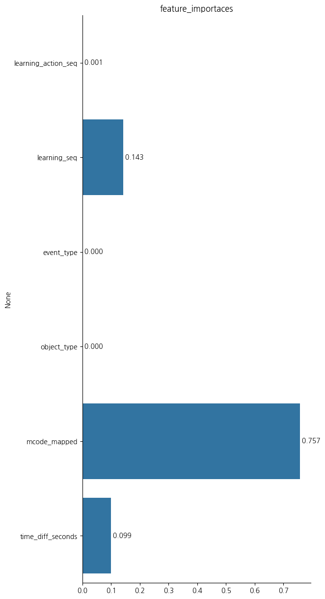

          - 이용 콘텐츠 유형이 가장 큰 영향을 준다는 것을 볼 수 있는데 여전히 편향적인 것을 볼 수 있다

    - 개선

      - AdaBoostClassifier 방식은 적합하지 않다고 생각하여 RandomForestClassifier를 통해 모델을 통해 생성

    - **RandomForestRegressor**

    - n_estimators=1000
    - 결과

    - score
      - train : 0.99
      - test : 1.0
    - feature_importaces

      ***

      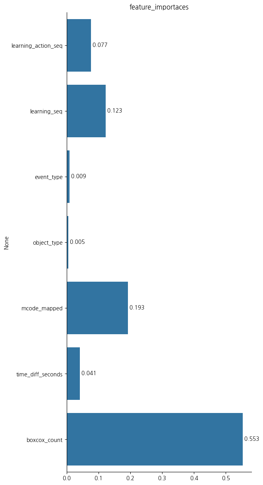

      - 앞선 모델에 비해 성능은 좋아졌지만 여전히 boxcox_count의 영향에 편향된 것으로 보아 마찬가지로 해단 feature을 제외하고 모델 생성 필요성이 존재

    - confusion_marix

      

        
        <table border="1" class="dataframe">
        <thead>
            <tr style="text-align: right;">
            <th></th>
            <th>0</th>
            <th>1</th>
            <th>2</th>
            <th>3</th>
            <th>4</th>
            <th>5</th>
            <th>6</th>
            <th>7</th>
            <th>8</th>
            <th>9</th>
            <th>10</th>
            <th>11</th>
            </tr>
        </thead>
        <tbody>
            <tr>
            <th>0</th>
            <td>53</td>
            <td>1</td>
            <td>0</td>
            <td>0</td>
            <td>0</td>
            <td>0</td>
            <td>0</td>
            <td>0</td>
            <td>0</td>
            <td>0</td>
            <td>0</td>
            <td>0</td>
            </tr>
            <tr>
            <th>1</th>
            <td>0</td>
            <td>228</td>
            <td>0</td>
            <td>0</td>
            <td>0</td>
            <td>1</td>
            <td>0</td>
            <td>0</td>
            <td>1</td>
            <td>0</td>
            <td>0</td>
            <td>0</td>
            </tr>
            <tr>
            <th>2</th>
            <td>0</td>
            <td>0</td>
            <td>104</td>
            <td>0</td>
            <td>0</td>
            <td>0</td>
            <td>0</td>
            <td>0</td>
            <td>0</td>
            <td>0</td>
            <td>0</td>
            <td>0</td>
            </tr>
            <tr>
            <th>3</th>
            <td>0</td>
            <td>0</td>
            <td>0</td>
            <td>159</td>
            <td>0</td>
            <td>0</td>
            <td>0</td>
            <td>0</td>
            <td>0</td>
            <td>0</td>
            <td>0</td>
            <td>0</td>
            </tr>
            <tr>
            <th>4</th>
            <td>0</td>
            <td>0</td>
            <td>0</td>
            <td>0</td>
            <td>3</td>
            <td>0</td>
            <td>0</td>
            <td>0</td>
            <td>0</td>
            <td>0</td>
            <td>0</td>
            <td>0</td>
            </tr>
            <tr>
            <th>5</th>
            <td>0</td>
            <td>0</td>
            <td>1</td>
            <td>0</td>
            <td>0</td>
            <td>162</td>
            <td>0</td>
            <td>0</td>
            <td>0</td>
            <td>0</td>
            <td>0</td>
            <td>0</td>
            </tr>
            <tr>
            <th>6</th>
            <td>0</td>
            <td>0</td>
            <td>1</td>
            <td>0</td>
            <td>0</td>
            <td>0</td>
            <td>186</td>
            <td>0</td>
            <td>0</td>
            <td>0</td>
            <td>0</td>
            <td>0</td>
            </tr>
            <tr>
            <th>7</th>
            <td>0</td>
            <td>0</td>
            <td>0</td>
            <td>0</td>
            <td>0</td>
            <td>0</td>
            <td>0</td>
            <td>13</td>
            <td>0</td>
            <td>0</td>
            <td>0</td>
            <td>0</td>
            </tr>
            <tr>
            <th>8</th>
            <td>0</td>
            <td>2</td>
            <td>0</td>
            <td>1</td>
            <td>0</td>
            <td>1</td>
            <td>0</td>
            <td>1</td>
            <td>190</td>
            <td>0</td>
            <td>0</td>
            <td>0</td>
            </tr>
            <tr>
            <th>9</th>
            <td>0</td>
            <td>0</td>
            <td>0</td>
            <td>0</td>
            <td>0</td>
            <td>0</td>
            <td>0</td>
            <td>0</td>
            <td>0</td>
            <td>20</td>
            <td>0</td>
            <td>0</td>
            </tr>
            <tr>
            <th>10</th>
            <td>0</td>
            <td>0</td>
            <td>0</td>
            <td>0</td>
            <td>0</td>
            <td>0</td>
            <td>1</td>
            <td>0</td>
            <td>0</td>
            <td>0</td>
            <td>49</td>
            <td>0</td>
            </tr>
            <tr>
            <th>11</th>
            <td>0</td>
            <td>0</td>
            <td>0</td>
            <td>0</td>
            <td>0</td>
            <td>0</td>
            <td>0</td>
            <td>0</td>
            <td>0</td>
            <td>0</td>
            <td>0</td>
            <td>118</td>
            </tr>
        </tbody>
        </table>
        

      - 해석
        - 앞선 모델에 비해 성능이 좋아졌음을 알 수 있다.

    - 추가적인 시도
        - boxcox_count feature가 편향적임을 확인했으므로 해당 feature을 제외하고 모델을 다시 생성
        - n_estimators=1000
        - 결과

        - score

            - train : 0.66
            - test : 0.95
            - 앞선 모델에 비해 성능은 다소 떨어진 것으로 보인다

        - feature_importaces

            ***

            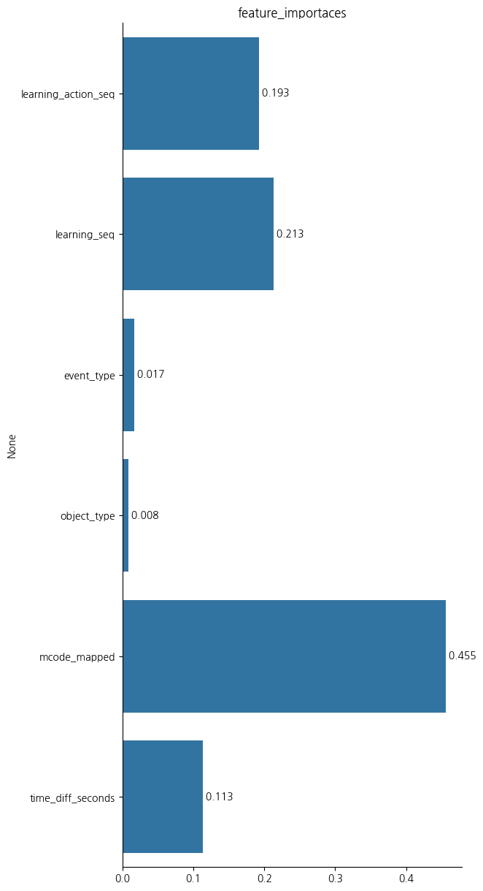

            - mcode_mapped가 가장 큰 영향을 준다는 것을 볼 수 있고 학습 방식에 대한 영향도 커진 것을 볼 수 있다. 시간 차이에 대한 feature도 영향이 늘어난 것을 볼 수 있다

### 9. 결론

---

- 회원 상태 유지 기간을 예측할 때 서비스 내 활동량과 콘텐츠 유형이 큰 영향을 준다는 것을 알 수 있는데 이는 직관적으로 생각해도 많이 활동하고 어떤 유형의 콘텐츠를 소비하는지가 가장 중요하다는 생각이 든다. 하지만 이 두 지표는 학생의 학습패턴을 이해하기에는 부족함이 있다. EDA파트에서 볼 수 있듯 활동량이 많아도 실질적으로 학습시간은 적을 수 있기 때문이다. 즉 유지 기간 예측을 위한 학습 패턴을 보다 명확히 알기 위해서는 영상과 학생이 직접 실습을 해보는 능동적인 콘텐츠가 필요하다. 단순히 영상을 시청하고 문제를 푸는 식이 아닌 영상을 시청하는 중간에 퀴즈 식의 문제를 추가하거나 앞서 배웠던 내용을 조합해야 이후 영상으로 넘어가는 등 학생의 능동적인 참여가 보장되는 영상 콘텐츠가 학습 패턴을 파악하는데 더 명확한 지표가 될 것이라고 생각이 든다.

### - 개선점

---

- day_n_status에서는 학생 상태를 알 수 있는데 해당 분석은 상태가 변화한 시점을 예측하는 분석이었다. 그러나 다양한 상태에 대한 예측 모델역시 필요함을 느꼈다.
- string 자료형을 int형으로 바꾸기 위해 0,1,2로 구분하였는데 이 부분이 줄 수 있는 영향에 대한 고찰이 부족하였다. 두 feature을 모두 0,1,2로 바꾸었기에 이를 구분할 수 있는 방법이 필요하다

* ### 개발 환경
  - Python(v3.12.4)
  - Jupyter(v2024.7.0)
