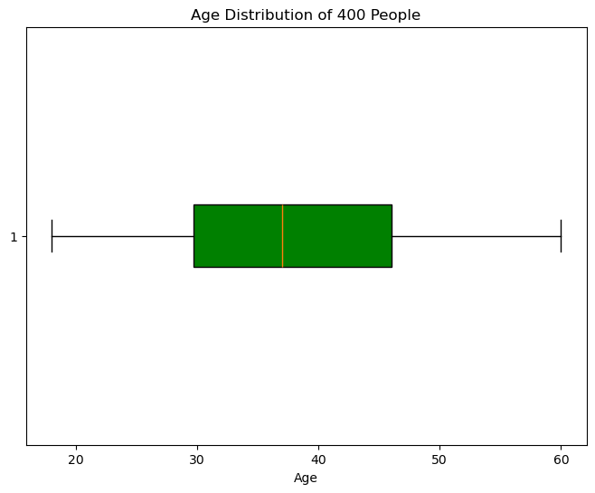
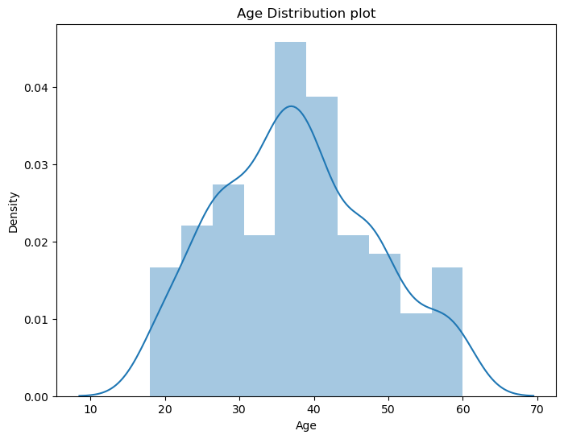
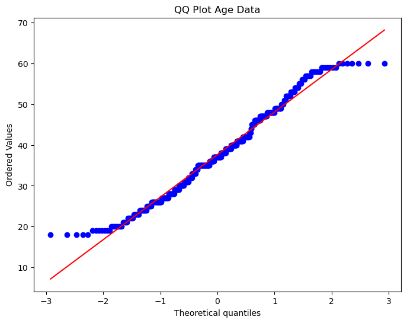
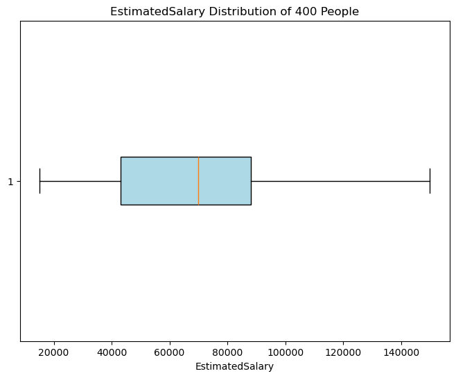
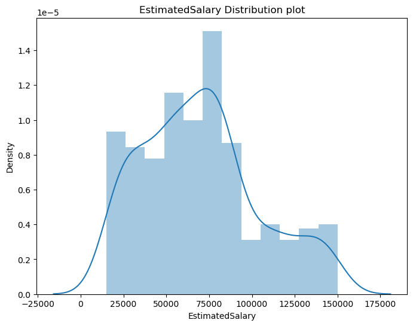
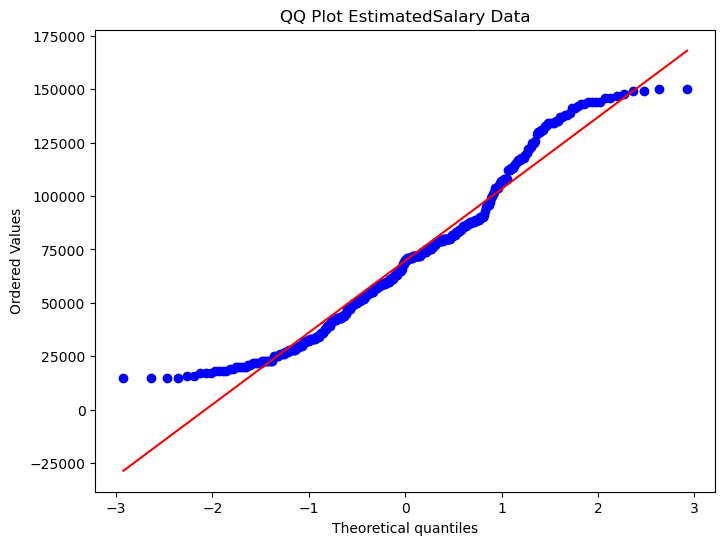

# 머신러닝 모델 구현 및 분석 보고서

## Sns Ads 데이터를 통한 적절한 모델 찾기

###### 빅데이터 9기 전동인

---

### 목차

1. [문제정의](#1-문제정의)
2. [데이터설명](#2-데이터-설명)
3. [데이터 탐색](#3-데이터-탐색)
4. [EDA](#4-eda)
5. [전처리](#5-전처리)
6. [아이디어](#6-아이디어)
7. [모델선정](#7-모델선정)
8. [결론](#8-결론)

---

### 1. 문제정의

- **상황**

  - sns광고는 다양한 집단(나이, 성별, 수입에 따른)의 사람들에게 시공간의 제약을 받지 않으며 제공가능하지만 이 모든 집단이 구매하는 행동까지는 이어지지 않는다. 또한 집단에 따른 구매율을 집계할 수 있고 그에 따른 차별적인 전략을 수립할 수 있다. 즉 같은 제품을 광고하더라도 구매율이 높은 집단과 낮은 집단에게 각각 다른 방식의 광고를 제시하는 방안을 모색해야 한다.

* **방향**

  - 나이, 수입, 성별 등의 Feature에 따라 구매여부를 가장 잘 예측하는 머신러닝 모델을 구현해보고자 한다. 가장 영향을 많이 주는 Feature을 찾아보고 해당 Feature내에서의 특징을 찾아보고자 한다

### 2. 데이터 설명

- 데이터셋 : Social_Network_Ads.csv
- 형태
  - 회원 정보 : 400
  - Feature : 5
- [데이터프레임설명](./Data_explain.md) : 별첨자료에서 제시

### 3. 데이터 탐색

---

- #### 중복값 : 없음

- #### 결측치 : 없음

- #### 요약

    

    
    <table border="1" class="dataframe">
    <thead>
        <tr style="text-align: right;">
        <th></th>
        <th>Age</th>
        <th>EstimatedSalary</th>
        <th>Purchased</th>
        </tr>
    </thead>
    <tbody>
        <tr>
        <th>count</th>
        <td>400.000000</td>
        <td>400.000000</td>
        <td>400.000000</td>
        </tr>
        <tr>
        <th>mean</th>
        <td>37.655000</td>
        <td>69742.500000</td>
        <td>0.357500</td>
        </tr>
        <tr>
        <th>std</th>
        <td>10.482877</td>
        <td>34096.960282</td>
        <td>0.479864</td>
        </tr>
        <tr>
        <th>min</th>
        <td>18.000000</td>
        <td>15000.000000</td>
        <td>0.000000</td>
        </tr>
        <tr>
        <th>25%</th>
        <td>29.750000</td>
        <td>43000.000000</td>
        <td>0.000000</td>
        </tr>
        <tr>
        <th>50%</th>
        <td>37.000000</td>
        <td>70000.000000</td>
        <td>0.000000</td>
        </tr>
        <tr>
        <th>75%</th>
        <td>46.000000</td>
        <td>88000.000000</td>
        <td>1.000000</td>
        </tr>
        <tr>
        <th>max</th>
        <td>60.000000</td>
        <td>150000.000000</td>
        <td>1.000000</td>
        </tr>
    </tbody>
    </table>
    

    > 나이는 38살 정도가 평균
    > 급여는 약 $70000가 평균
    > 약 36%정도가 구매

### 4. EDA

---

- ## Age 분포

  - BoxPlot
    
  - DistPlot
    
  - QQPlot
    

  - 30대 중반에서 40대 정도에 가장 많은 분포를 보이고 정규분포에 비슷한 형태를 보인다고 할 수 있다. qq플랏에서도 끝이 조금 튀지만 직선형태를 따른다고 할 수 있다.

- ## EstimatedSalary 분포

  - BoxPlot
    
  - DistPlot
    
  - QQPlot
    

  - 70000에서 75000사이에 가장 많은 분포를 보이고 100000이상 임금으로 갈 수록 그 수가 줄어드는 모습을 볼 수 있다. qq플랏에서도 직선 형태로 보인다고 하기 어렵다.

- ## 임금과 나이의 관계

  - regplot
    

  - 추세선을 보면 나이가 많아질수록 임금이 다소 높아진다는 경향을 볼 수 있는데 그 기울기가 작기 때문에 관계가 있다고 이야기하기 어렵다. 18세~20세 초반까지는 100000이상의 고임금이 발생하지 않는 것을 볼 수 있고 금액이 대부분 골고루 분포하는 것을 볼 수 있다. 추가적으로 두 Feature간의 상관관계를 살펴보기 위해 피어슨 상관분석을 실시해보았다.

  - 피어슨 상관분석
    > correaltion coefficient : 0.15523801797210007, p-value : 0.0018460568005798244
    > 상관계수가 약 0.16이고 p-value는 약 0.002이다. 유의수준을 0.05로 했을 때 기각되므로 나이와 임금사이에는 약한 양의 상관관계가 존재한다고 할 수 있다.

* ## 콘텐츠별 투자한 시간
  
  - 앞선 학생별 활동량과는 상이한 결과가 나왔는데 가장 많은 활동량이 많았던 stu26학생은 활동 시간으로 본다면 거의 0에 수렴하는 것을 볼 수 있다. 즉 콘텐츠를 많이 이용해서 활동량이 높은 것이 아닌 실제 일시정지, 넘기는 등 한 콘텐츠 내에서 학생의 활동이 많아서 나온 결과로 추측된다. 시간으로 친다면 stu15의 시간이 가장 긴것을 볼 수 있다.

### 5. 전처리

---

- #### Gender Feature

  - 성별은 string 타입임으로 레이블 인코더로 전처리
    > 남(1), 여(0)

- #### 연령대 구간에 대한 열 추가

  - 연령이 18세에서 60세까지 넓게 포진되어 있는데 연령대별 특징이 있을 수 있기에 10대 단위로 끊어 새로운 열 추가
    > 10대 단위로 끊은 이유 : 분포를 보면 30대 중반에 많이 포진되어 있지만 구간별 수의 차이가 나더라도 연령(세대)
  - DigitalResource => 2
  - VideoObject => 1
  - WebPage => 0

- #### event_type 자료형 변환

  - 해당 feature은 학생이 어떤 방식으로 콘텐츠를 이용했는지를 구분하는데 string 자료형이기에 숫자로 바꿈.
    - MediaEvent => 2
    - NavigationEvent => 1
    - ViewEvent => 0

- #### mcode 자료형 변환

  - mcode는 학생이 이용한 콘텐츠를 구분하는 정보이다. userid와 비슷한 개념으로 학생이 아닌 콘텐츠를 구분하는 역할을 한다. string 자료형으로 정리되어 있기에 랜덤하게 숫자를 지정하여 각 코드에 맞게 매핑을 하여 int형으로 변환하였다.

- #### 시간차이열 추가
  - 해당 데이터에 시간을 나타내는 것은 년월일시분초로 나타나있는데 실제 학생이 콘텐츠별 어느정도 시간을 투자하는지를 초단위로 보기위해 time_diff_seconds라는 열추가. 같은 학생의 콘텐츠별 시작 시간과 끝나시간의 차이를 구하여 지정.
  - 해당 열에서 양수 이외의 0이나 음수가 등장하는데 확인 결과 당일 콘텐츠를 종료하지 않고 다음날 계속되어 진행되는 경우 이를 뺏을 때 0이나 음수가 나타나는 것을 확인

### 6. 추가적인 전처리

---

- 필요성 : 학생들의 활동량이 매우 편향적인 것을 볼 수 있다. 서비스를 활용한 카운트 값이기에 특정 학생에 값이 치중되어 있는데 치중된만큼 상태 변화일 수에 영향을 주기 때문에 자료를 정규성에 맞게 변환하는 작업을 해보았다.

- 변환 :

  - 로그 변환

    - 그래프
      
    - qqplot
      

  - 박스콕스 변환

    - 그래프
      
    - qqplot
      

  - 박스콕스 변환이 로그 변환에 비해 정규성을 띈다고 볼 수 있고 boxcox_count라는 열을 새로 만들어 변환된 값을 추가하였다

### 7. 아이디어

---

- **학생 학습 태도별 상태기간 예측모델** : change_date에선 일자를 볼 수 있는데 예를들어 26이라면 26일만에 학생의 구독 상태가 바뀌었다는 것을 의미한다. 즉 이 숫자가 클수록 구독을 오래했다는 유지한다는 의미이고 작을수록 상대적으로 일찍 구독 상태가 바뀌었다는 것을 알 수 있다. 즉 이 change_date의 값에 영향을 줄 수 있는 요인으로 예측모델을 만들어 어떻게 하면 구독을 오래 유지할 수 있을지 알아보고자 한다.

### 8. 모델선정

---

- X,y 선정

  - X : "learning_action_seq", "learning_seq", "event_type", "object_type", "mcode_mapped","time_diff_seconds","boxcox_count"

    - 필요한 feature은 이렇게 지정함. 전처리 과정에서 string type을 int형으로 구분하였고 실제 학습 방식와 관련이 있는 feature만 골라내어 X로 생성

  - y : change_date열을 y로 지정

- 모델

  - AdaBoostClassifier, RandomForestClassifier을 활용하여 성능을 비교하고 유의미한 feature_importaces 찾아보고자 한다.

  - **AdaBoostClassifier**

    - n_estimators=1000
    - 결과

      - score
        - train : 0.42
        - test : 0.43
      - feature_importaces

        ***

        

        - boxcox_count가 1.0인데 매우 편향적인 것을 알 수 있고 해당 feature만 보고 예측한 것으로 해석된다

      - confusion_marix

        

        
        <table border="1" class="dataframe">
        <thead>
            <tr style="text-align: right;">
            <th></th>
            <th>0</th>
            <th>1</th>
            <th>2</th>
            <th>3</th>
            <th>4</th>
            <th>5</th>
            <th>6</th>
            <th>7</th>
            <th>8</th>
            <th>9</th>
            <th>10</th>
            <th>11</th>
            </tr>
        </thead>
        <tbody>
            <tr>
            <th>0</th>
            <td>0</td>
            <td>54</td>
            <td>0</td>
            <td>0</td>
            <td>0</td>
            <td>0</td>
            <td>0</td>
            <td>0</td>
            <td>0</td>
            <td>0</td>
            <td>0</td>
            <td>0</td>
            </tr>
            <tr>
            <th>1</th>
            <td>0</td>
            <td>230</td>
            <td>0</td>
            <td>0</td>
            <td>0</td>
            <td>0</td>
            <td>0</td>
            <td>0</td>
            <td>0</td>
            <td>0</td>
            <td>0</td>
            <td>0</td>
            </tr>
            <tr>
            <th>2</th>
            <td>0</td>
            <td>0</td>
            <td>104</td>
            <td>0</td>
            <td>0</td>
            <td>0</td>
            <td>0</td>
            <td>0</td>
            <td>0</td>
            <td>0</td>
            <td>0</td>
            <td>0</td>
            </tr>
            <tr>
            <th>3</th>
            <td>0</td>
            <td>76</td>
            <td>83</td>
            <td>0</td>
            <td>0</td>
            <td>0</td>
            <td>0</td>
            <td>0</td>
            <td>0</td>
            <td>0</td>
            <td>0</td>
            <td>0</td>
            </tr>
            <tr>
            <th>4</th>
            <td>0</td>
            <td>0</td>
            <td>0</td>
            <td>0</td>
            <td>3</td>
            <td>0</td>
            <td>0</td>
            <td>0</td>
            <td>0</td>
            <td>0</td>
            <td>0</td>
            <td>0</td>
            </tr>
            <tr>
            <th>5</th>
            <td>0</td>
            <td>160</td>
            <td>0</td>
            <td>0</td>
            <td>3</td>
            <td>0</td>
            <td>0</td>
            <td>0</td>
            <td>0</td>
            <td>0</td>
            <td>0</td>
            <td>0</td>
            </tr>
            <tr>
            <th>6</th>
            <td>0</td>
            <td>0</td>
            <td>34</td>
            <td>0</td>
            <td>0</td>
            <td>0</td>
            <td>153</td>
            <td>0</td>
            <td>0</td>
            <td>0</td>
            <td>0</td>
            <td>0</td>
            </tr>
            <tr>
            <th>7</th>
            <td>0</td>
            <td>0</td>
            <td>0</td>
            <td>0</td>
            <td>0</td>
            <td>0</td>
            <td>0</td>
            <td>0</td>
            <td>0</td>
            <td>0</td>
            <td>13</td>
            <td>0</td>
            </tr>
            <tr>
            <th>8</th>
            <td>0</td>
            <td>154</td>
            <td>0</td>
            <td>0</td>
            <td>0</td>
            <td>0</td>
            <td>0</td>
            <td>0</td>
            <td>41</td>
            <td>0</td>
            <td>0</td>
            <td>0</td>
            </tr>
            <tr>
            <th>9</th>
            <td>0</td>
            <td>0</td>
            <td>0</td>
            <td>0</td>
            <td>0</td>
            <td>0</td>
            <td>0</td>
            <td>0</td>
            <td>0</td>
            <td>0</td>
            <td>20</td>
            <td>0</td>
            </tr>
            <tr>
            <th>10</th>
            <td>0</td>
            <td>0</td>
            <td>42</td>
            <td>0</td>
            <td>0</td>
            <td>0</td>
            <td>0</td>
            <td>0</td>
            <td>0</td>
            <td>0</td>
            <td>8</td>
            <td>0</td>
            </tr>
            <tr>
            <th>11</th>
            <td>0</td>
            <td>118</td>
            <td>0</td>
            <td>0</td>
            <td>0</td>
            <td>0</td>
            <td>0</td>
            <td>0</td>
            <td>0</td>
            <td>0</td>
            <td>0</td>
            <td>0</td>
            </tr>
        </tbody>
        </table>
        

      - 해석
        - 열이 예측, 행이 정답에 대한 confusion 매트릭스인데 정답을 맞추는 능력이 떨어지는 것을 볼 수 있다.

    - 추가적인 시도

      - boxcox_count feature가 편향적임을 확인했으므로 해당 feature을 제외하고 모델을 다시 생성
      - n_estimators=1000
      - 결과

        - score

          - train : 0.13
          - test : 0.14
          - 앞선 모델에 비해 성능이 현저히 떨어진 것을 볼 수 있다

        - feature_importaces

          ***

          

          - 이용 콘텐츠 유형이 가장 큰 영향을 준다는 것을 볼 수 있는데 여전히 편향적인 것을 볼 수 있다

    - 개선

      - AdaBoostClassifier 방식은 적합하지 않다고 생각하여 RandomForestClassifier를 통해 모델을 통해 생성

    - **RandomForestRegressor**

    - n_estimators=1000
    - 결과

    - score
      - train : 0.99
      - test : 1.0
    - feature_importaces

      ***

      

      - 앞선 모델에 비해 성능은 좋아졌지만 여전히 boxcox_count의 영향에 편향된 것으로 보아 마찬가지로 해단 feature을 제외하고 모델 생성 필요성이 존재

    - confusion_marix

      

        
        <table border="1" class="dataframe">
        <thead>
            <tr style="text-align: right;">
            <th></th>
            <th>0</th>
            <th>1</th>
            <th>2</th>
            <th>3</th>
            <th>4</th>
            <th>5</th>
            <th>6</th>
            <th>7</th>
            <th>8</th>
            <th>9</th>
            <th>10</th>
            <th>11</th>
            </tr>
        </thead>
        <tbody>
            <tr>
            <th>0</th>
            <td>53</td>
            <td>1</td>
            <td>0</td>
            <td>0</td>
            <td>0</td>
            <td>0</td>
            <td>0</td>
            <td>0</td>
            <td>0</td>
            <td>0</td>
            <td>0</td>
            <td>0</td>
            </tr>
            <tr>
            <th>1</th>
            <td>0</td>
            <td>228</td>
            <td>0</td>
            <td>0</td>
            <td>0</td>
            <td>1</td>
            <td>0</td>
            <td>0</td>
            <td>1</td>
            <td>0</td>
            <td>0</td>
            <td>0</td>
            </tr>
            <tr>
            <th>2</th>
            <td>0</td>
            <td>0</td>
            <td>104</td>
            <td>0</td>
            <td>0</td>
            <td>0</td>
            <td>0</td>
            <td>0</td>
            <td>0</td>
            <td>0</td>
            <td>0</td>
            <td>0</td>
            </tr>
            <tr>
            <th>3</th>
            <td>0</td>
            <td>0</td>
            <td>0</td>
            <td>159</td>
            <td>0</td>
            <td>0</td>
            <td>0</td>
            <td>0</td>
            <td>0</td>
            <td>0</td>
            <td>0</td>
            <td>0</td>
            </tr>
            <tr>
            <th>4</th>
            <td>0</td>
            <td>0</td>
            <td>0</td>
            <td>0</td>
            <td>3</td>
            <td>0</td>
            <td>0</td>
            <td>0</td>
            <td>0</td>
            <td>0</td>
            <td>0</td>
            <td>0</td>
            </tr>
            <tr>
            <th>5</th>
            <td>0</td>
            <td>0</td>
            <td>1</td>
            <td>0</td>
            <td>0</td>
            <td>162</td>
            <td>0</td>
            <td>0</td>
            <td>0</td>
            <td>0</td>
            <td>0</td>
            <td>0</td>
            </tr>
            <tr>
            <th>6</th>
            <td>0</td>
            <td>0</td>
            <td>1</td>
            <td>0</td>
            <td>0</td>
            <td>0</td>
            <td>186</td>
            <td>0</td>
            <td>0</td>
            <td>0</td>
            <td>0</td>
            <td>0</td>
            </tr>
            <tr>
            <th>7</th>
            <td>0</td>
            <td>0</td>
            <td>0</td>
            <td>0</td>
            <td>0</td>
            <td>0</td>
            <td>0</td>
            <td>13</td>
            <td>0</td>
            <td>0</td>
            <td>0</td>
            <td>0</td>
            </tr>
            <tr>
            <th>8</th>
            <td>0</td>
            <td>2</td>
            <td>0</td>
            <td>1</td>
            <td>0</td>
            <td>1</td>
            <td>0</td>
            <td>1</td>
            <td>190</td>
            <td>0</td>
            <td>0</td>
            <td>0</td>
            </tr>
            <tr>
            <th>9</th>
            <td>0</td>
            <td>0</td>
            <td>0</td>
            <td>0</td>
            <td>0</td>
            <td>0</td>
            <td>0</td>
            <td>0</td>
            <td>0</td>
            <td>20</td>
            <td>0</td>
            <td>0</td>
            </tr>
            <tr>
            <th>10</th>
            <td>0</td>
            <td>0</td>
            <td>0</td>
            <td>0</td>
            <td>0</td>
            <td>0</td>
            <td>1</td>
            <td>0</td>
            <td>0</td>
            <td>0</td>
            <td>49</td>
            <td>0</td>
            </tr>
            <tr>
            <th>11</th>
            <td>0</td>
            <td>0</td>
            <td>0</td>
            <td>0</td>
            <td>0</td>
            <td>0</td>
            <td>0</td>
            <td>0</td>
            <td>0</td>
            <td>0</td>
            <td>0</td>
            <td>118</td>
            </tr>
        </tbody>
        </table>
        

      - 해석
        - 앞선 모델에 비해 성능이 좋아졌음을 알 수 있다.

    - 추가적인 시도
        - boxcox_count feature가 편향적임을 확인했으므로 해당 feature을 제외하고 모델을 다시 생성
        - n_estimators=1000
        - 결과

        - score

            - train : 0.66
            - test : 0.95
            - 앞선 모델에 비해 성능은 다소 떨어진 것으로 보인다

        - feature_importaces

            ***

            

            - mcode_mapped가 가장 큰 영향을 준다는 것을 볼 수 있고 학습 방식에 대한 영향도 커진 것을 볼 수 있다. 시간 차이에 대한 feature도 영향이 늘어난 것을 볼 수 있다

###

### 9. 결론

---

- 회원 상태 유지 기간을 예측할 때 서비스 내 활동량과 콘텐츠 유형이 큰 영향을 준다는 것을 알 수 있는데 이는 직관적으로 생각해도 많이 활동하고 어떤 유형의 콘텐츠를 소비하는지가 가장 중요하다는 생각이 든다. 하지만 이 두 지표는 학생의 학습패턴을 이해하기에는 부족함이 있다. EDA파트에서 볼 수 있듯 활동량이 많아도 실질적으로 학습시간은 적을 수 있기 때문이다. 즉 유지 기간 예측을 위한 학습 패턴을 보다 명확히 알기 위해서는 영상과 학생이 직접 실습을 해보는 능동적인 콘텐츠가 필요하다. 단순히 영상을 시청하고 문제를 푸는 식이 아닌 영상을 시청하는 중간에 퀴즈 식의 문제를 추가하거나 앞서 배웠던 내용을 조합해야 이후 영상으로 넘어가는 등 학생의 능동적인 참여가 보장되는 영상 콘텐츠가 학습 패턴을 파악하는데 더 명확한 지표가 될 것이라고 생각이 든다.

### - 개선점

---

- day_n_status에서는 학생 상태를 알 수 있는데 해당 분석은 상태가 변화한 시점을 예측하는 분석이었다. 그러나 다양한 상태에 대한 예측 모델역시 필요함을 느꼈다.
- string 자료형을 int형으로 바꾸기 위해 0,1,2로 구분하였는데 이 부분이 줄 수 있는 영향에 대한 고찰이 부족하였다. 두 feature을 모두 0,1,2로 바꾸었기에 이를 구분할 수 있는 방법이 필요하다

* ### 개발 환경
  - Python(v3.12.4)
  - Jupyter(v2024.7.0)
