# 머신러닝 모델 구현 및 분석 보고서

## Sns Ads 데이터를 활용한 구매여부 예측 모델

###### 빅데이터 9기 전동인

---

### 목차

1. [문제정의](#1-문제정의)
2. [데이터설명](#2-데이터-설명)
3. [데이터 탐색](#3-데이터-탐색)
4. [EDA](#4-eda)
5. [전처리](#5-전처리)
6. [아이디어](#6-아이디어)
7. [모델선정](#7-모델선정)
8. [결론](#8-결론)

---

### 1. 문제정의

- **상황**

  - sns광고는 다양한 집단(나이, 성별, 수입에 따른)의 사람들에게 시공간의 제약을 받지 않으며 제공가능하지만 이 모든 집단이 구매하는 행동까지는 이어지지 않는다. 또한 집단에 따른 구매율을 집계할 수 있고 그에 따른 차별적인 전략을 수립할 수 있다. 즉 같은 제품을 광고하더라도 구매율이 높은 집단과 낮은 집단에게 각각 다른 방식의 광고를 제시하는 방안을 모색해야 한다.

* **방향**

  - 나이, 수입, 성별 등의 Feature에 따라 구매여부를 가장 잘 예측하는 머신러닝 모델을 구현해보고자 한다. 가장 영향을 많이 주는 Feature을 찾아보고 해당 Feature내에서의 특징을 찾아보고자 한다

### 2. 데이터 설명

- 데이터셋 : Social_Network_Ads.csv
- 형태
  - 회원 정보 : 400
  - Feature : 5
- [데이터프레임설명](./Data_explain.md) : 별첨자료에서 제시

### 3. 데이터 탐색

---

- #### 중복값 : 없음

- #### 결측치 : 없음

- #### 요약

    <div>
    <style scoped>
        .dataframe tbody tr th:only-of-type {
            vertical-align: middle;
        }

        .dataframe tbody tr th {
            vertical-align: top;
        }

        .dataframe thead th {
            text-align: right;
        }

    </style>
    <table border="1" class="dataframe">
    <thead>
        <tr style="text-align: right;">
        <th></th>
        <th>Age</th>
        <th>EstimatedSalary</th>
        <th>Purchased</th>
        </tr>
    </thead>
    <tbody>
        <tr>
        <th>count</th>
        <td>400.000000</td>
        <td>400.000000</td>
        <td>400.000000</td>
        </tr>
        <tr>
        <th>mean</th>
        <td>37.655000</td>
        <td>69742.500000</td>
        <td>0.357500</td>
        </tr>
        <tr>
        <th>std</th>
        <td>10.482877</td>
        <td>34096.960282</td>
        <td>0.479864</td>
        </tr>
        <tr>
        <th>min</th>
        <td>18.000000</td>
        <td>15000.000000</td>
        <td>0.000000</td>
        </tr>
        <tr>
        <th>25%</th>
        <td>29.750000</td>
        <td>43000.000000</td>
        <td>0.000000</td>
        </tr>
        <tr>
        <th>50%</th>
        <td>37.000000</td>
        <td>70000.000000</td>
        <td>0.000000</td>
        </tr>
        <tr>
        <th>75%</th>
        <td>46.000000</td>
        <td>88000.000000</td>
        <td>1.000000</td>
        </tr>
        <tr>
        <th>max</th>
        <td>60.000000</td>
        <td>150000.000000</td>
        <td>1.000000</td>
        </tr>
    </tbody>
    </table>
    </div>

  > 나이는 38살 정도가 평균

  > 급여는 약 \$70000가 평균

  > 약 36%정도가 구매

### 4. EDA

---

- ## Age 분포

#1. 박스플랏 제거

- BoxPlot

  

- DistPlot

  

- QQPlot

  

#2. qq플랏을 읽을 때는 표현을 조금 더 구체적으로

- 30대 중반에서 40대 정도에 가장 많은 분포를 보이고 정규분포에 비슷한 형태를 보인다고 할 수 있다. qq플랏에서도 끝이 조금 튀지만 직선형태를 따른다고 할 수 있다.

- ## EstimatedSalary 분포

  - BoxPlot

    

  - DistPlot

    

  - QQPlot

    

  - 70000에서 75000사이에 가장 많은 분포를 보이고 100000이상 임금으로 갈 수록 그 수가 줄어드는 모습을 볼 수 있다. qq플랏에서도 직선 형태로 보인다고 하기 어렵다.

- ## 임금과 나이의 관계

  - regplot

    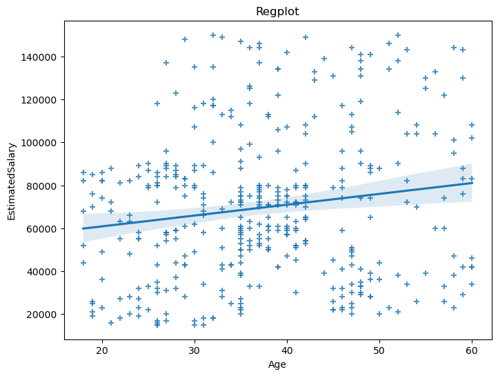

#3. 양의 상관관계가 있다고 이야기하기 어려움

- 추세선을 보면 나이가 많아질수록 임금이 다소 높아진다는 경향을 볼 수 있는데 그 기울기가 작기 때문에 관계가 있다고 단정하기 어렵다. 18세~20세 초반까지는 100000이상의 고임금이 발생하지 않는 것을 볼 수 있고 금액이 대부분 골고루 분포하는 것을 볼 수 있다. 추가적으로 두 Feature간의 상관관계를 살펴보기 위해 피어슨 상관분석을 실시해보았다.

- 피어슨 상관분석

  > correaltion coefficient : 0.15523801797210007, p-value : 0.0018460568005798244

  > 상관계수가 약 0.16이고 p-value는 약 0.002이다. 유의수준을 0.05로 했을 때 기각되므로 나이와 임금사이에는 약한 양의 상관관계가 존재한다고 할 수 있다.

* ## 연령대별 임금 평균

4. 연령대라벨 이름 변경
5. 그래프 색상 변경
6. 임금 단위 추가
7. 스케일을 줄이자

- Age_label_meanplot

  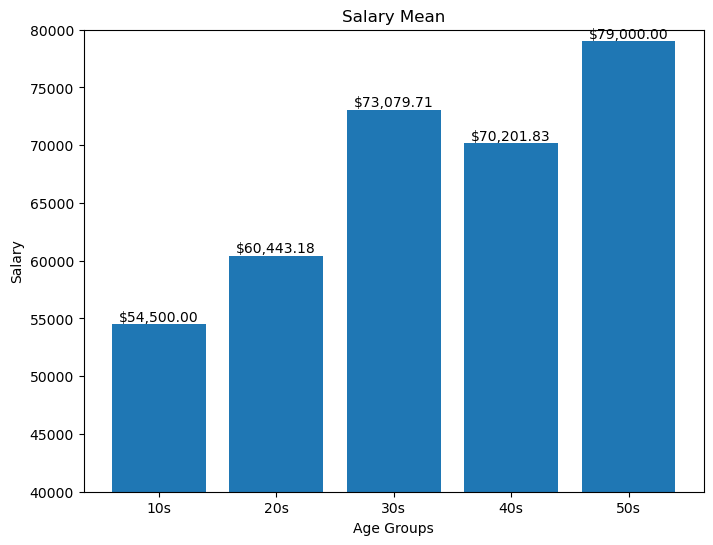

- 10대에서 가장 낮은 임금 평균을, 50대에서 가장 높은 임금 평균을 볼 수 있다. 30대가 넘어가며 \$70000를 넘어가는 것을 볼 수 있고 2022년 기준 미국 연봉 평균이 77460이라는 것을 보았을 때 어느정도 유사하다고 생각해볼 수 있다.

- ## 구매 비율

  - Purchased_class_plot

    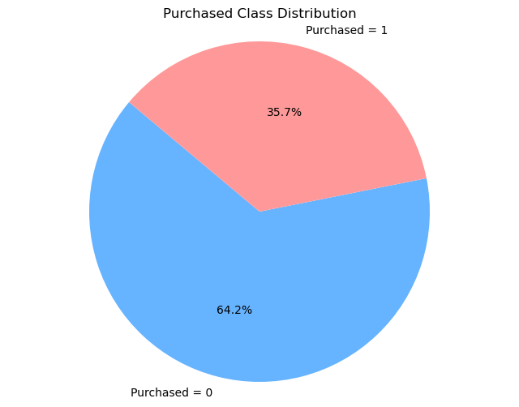

  - 비구매율이 더 높은 것으로 나타난다

### 5. 전처리

---

- #### Gender Feature

  - 성별은 string 타입임으로 레이블 인코더로 전처리
    > 남(1), 여(0)

- #### 연령대 구간에 대한 열 추가

  - 연령이 18세에서 60세까지 넓게 포진되어 있는데 연령대별 특징이 있을 수 있기에 10대 단위로 끊어 새로운 열 추가
    > 10대 단위로 끊은 이유 : 분포를 보면 30대 중반에 많이 포진되어 있지만 구간별 수의 차이가 나더라도 연령(세대)

- #### 표준화
  - `StandardScaler`를 통해 데이터 표준화. Purchased에 대한 부분은 실제 구매여부를 0,1 이진분류로 구분하는 종속변수이기에 표준화이후 0,1로 다시 저장하여 처리. 완성된 데이터를 df_scaled로 최종 저장

### 6. 아이디어

---

- **회원별 Feature 정보를 활용한 구매 여부 예측 모델** :
  - Feature : 데이터셋에서 User ID는 단순 회원 구분용도 임으로 이를 제외하고 Gender, Age, EstimatedSalary, Age_label 이렇게 4가지 feature가 구매여부에 어떤 영향을 주고 feature 들 간에는 서로 어떤 영향이 있는지 보고자 함
  - Target : 구매여부인 Purchased를 예측
  - 분류, 회귀, 클러스터, 생존분석을 통하여 영향을 비교해보고 가장 성능이 좋은 예측 모델 선정.
    - 분류 : RandomForestClassifier
    - 회귀 : LogisticRegression
    - 클러스터 : KMeans
    - 생존분석 : KaplanMeierFitter

### 7. 모델선정

---

8. age와 age_label에서 공선성이 크게 나타남,

- X,y 선정

  - X : "Gender", "Age", "EstimatedSalary", "Age_label" (scaled)

  - y : "Purchased" (0(비구매),1(구매))

- 모델

  - **RandomForestClassifier**

    - n_estimators=1000
    - 결과

      - score
        - train : 0.9969
        - test : 0.8875
      - feature_importaces

        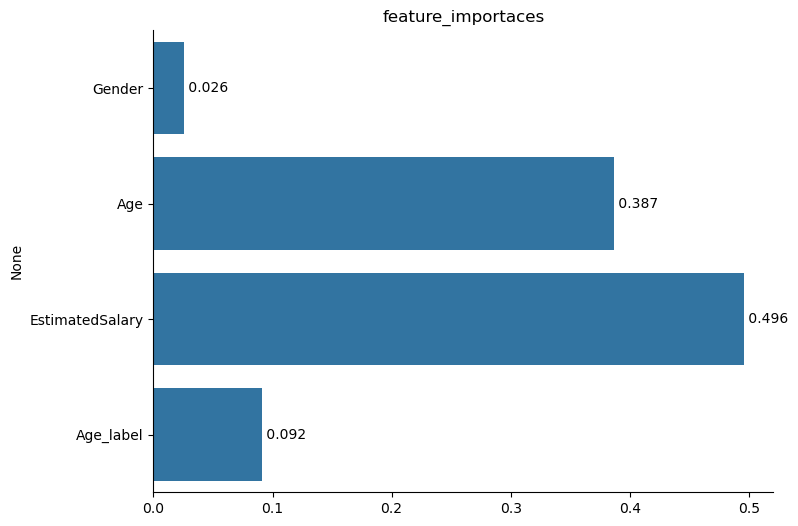

        - Age와 EstimatedSalary에서 높은 값을 보여주며 EstimatedSalary에서 가장 큰 영향을 준다고 볼 수 있다. 연령대구간은 연령보다 현저히 적은 영향을 보여주는데 임의로 나눈 구간이 연령대의 특징을 반영하지 못한다고 이야기할 수 있고 Age와 EstimatedSalary 간의 관계에서 발생하는 영향도 있을 것으로 예상된다.

      - confusion_marix

        <div>
        <style scoped>
            .dataframe tbody tr th:only-of-type {
                vertical-align: middle;
            }

            .dataframe tbody tr th {
                vertical-align: top;
            }

            .dataframe thead th {
                text-align: right;
            }

        </style>
        <table border="1" class="dataframe">
          <thead>
            <tr style="text-align: right;">
              <th></th>
              <th>Predicted Negative</th>
              <th>Predicted Positive</th>
            </tr>
          </thead>
          <tbody>
            <tr>
              <th>Actual Negative</th>
              <td>47</td>
              <td>5</td>
            </tr>
            <tr>
              <th>Actual Positive</th>
              <td>4</td>
              <td>24</td>
            </tr>
          </tbody>
        </table>
        </div>


        - 해석
          - 구매하지 않을 것을 예측하여 맞추는 부분이 가장 크게 나타났는데 비구매율이 높은 상태로 모델을 돌렸기에 어느정도 맞게 예측했음을 알 수 있다.

    - Shap

      - 모델 예측에 각 feature가 어떻게 기여했는지를 확인해보고자 진행

9. gender는 구분이 명확하기에 고려해볼만 함
   `Feature 0 : Gender Feature 1 : EstimatedSalary Feature 2 : Age Feature 3 : Age_label`

   - Summary_plot

     

   - Summary_plot_bar

     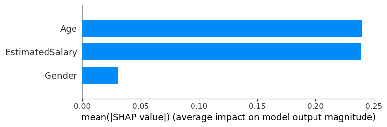

     - 해석 : Feature_importaces의 결과와 유사하게 나타난다. 특이하게 Age_label은 Feature Value가 높을수록 shap value가 낮은 것을 볼 수 있다.

   - KFold
     ```
     1번째 Cross Validation 정확도: 97.50%
     2번째 Cross Validation 정확도: 75.00%
     3번째 Cross Validation 정확도: 90.00%
     4번째 Cross Validation 정확도: 95.00%
     5번째 Cross Validation 정확도: 97.50%
     6번째 Cross Validation 정확도: 82.50%
     7번째 Cross Validation 정확도: 82.50%
     8번째 Cross Validation 정확도: 82.50%
     9번째 Cross Validation 정확도: 82.50%
     10번째 Cross Validation 정확도: 95.00%
     -------------------------------------------
     Cross Validation 정확도 평균: 88.00%
     ```

- **LogisticRegression**

  - 결과

  - score
    - train : 0.8444
    - test : 0.725
    - 점수는 RandomForestClassifier에 비해 낮아졌음을 볼 수 있다


    - confusion_marix
      <div>
      <style scoped>
          .dataframe tbody tr th:only-of-type {
              vertical-align: middle;
          }

          .dataframe tbody tr th {
              vertical-align: top;
          }

          .dataframe thead th {
              text-align: right;
          }
      </style>
      <table border="1" class="dataframe">
        <thead>
          <tr style="text-align: right;">
            <th></th>
            <th>Predicted Negative</th>
            <th>Predicted Positive</th>
          </tr>
        </thead>
        <tbody>
          <tr>
            <th>Actual Negative</th>
            <td>24</td>
            <td>1</td>
          </tr>
          <tr>
            <th>Actual Positive</th>
            <td>10</td>
            <td>5</td>
          </tr>
        </tbody>
      </table>
      </div>

      - 해석
        - 실제 구매를 비구매로 예측하는 비율이 높아졌다. 구매에 비해 비구매를 많이 예측하는 비율 역시 비구매쪽에 좀 더 편향된 것을 볼 수 있다.

    - ROC Curve

      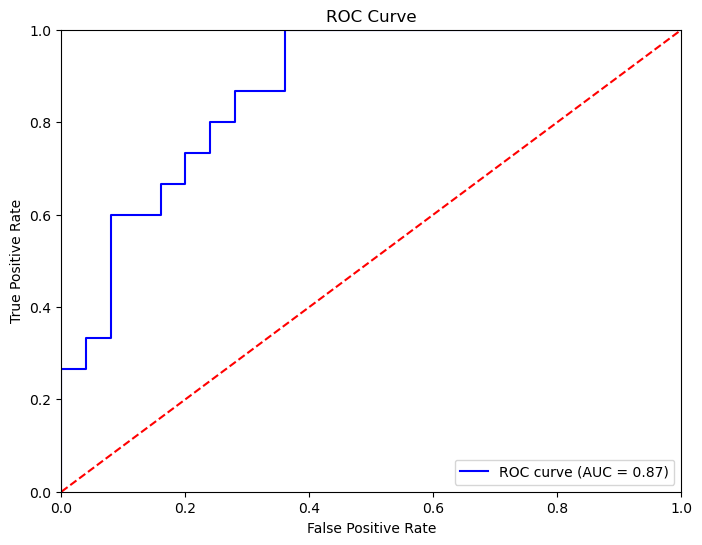

    - False Positive Rate가 낮은 구간에서 True Positive Rate이 높은 것을 확인할 수 있다.

    - Shap
      - 모델 예측에 각 feature가 어떻게 기여했는지를 확인해보고자 진행
      ```
      Feature 0 : Gender
      Feature 1 : EstimatedSalary
      Feature 2 : Age
      Feature 3 : Age_label
      ```
      - Summary_plot

        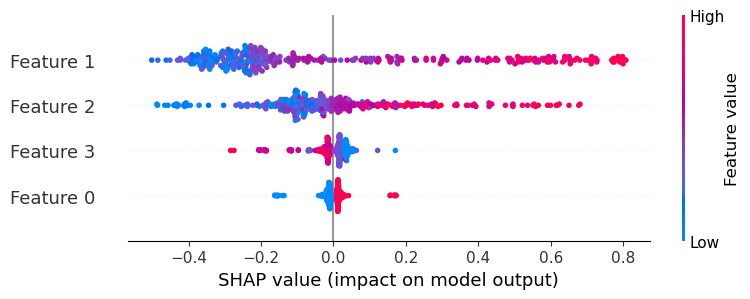

      - Summary_plot_bar

        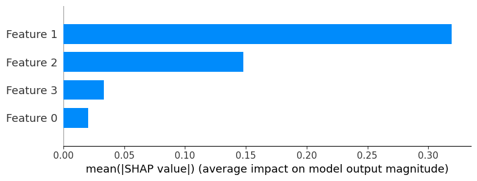

      - 랜덤포레스트 모델과 유사한 모습을 볼 수 있다. 즉 임금과 나이가 구매 여부에 영향을 많이 주고 성별이나 연령대는 그에 비해 영향이 적다고 할 수 있다.

    - KFold
      ```
      1번째 Cross Validation 정확도: 67.50%
      2번째 Cross Validation 정확도: 67.50%
      3번째 Cross Validation 정확도: 95.00%
      4번째 Cross Validation 정확도: 95.00%
      5번째 Cross Validation 정확도: 100.00%
      6번째 Cross Validation 정확도: 87.50%
      7번째 Cross Validation 정확도: 80.00%
      8번째 Cross Validation 정확도: 80.00%
      9번째 Cross Validation 정확도: 82.50%
      10번째 Cross Validation 정확도: 72.50%
      -------------------------------------------
      Cross Validation 정확도 평균: 82.75%
      ```

- **KMeansClustering**

10. 답을 빼고 모델을 돌리기

- 별도의 y를 설정하지 않고 Feature들을 통해서 구매여부를 클러스터링 해보고자 함
- Age, EstimatedSalary, Purchased feature만 활용하여 진행
- Elbow Method

  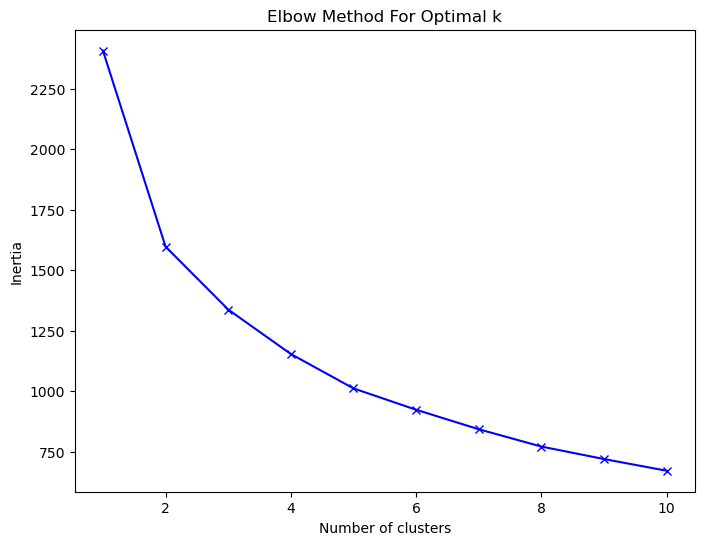

- k값 설정 : 구매여부(0,1)로 구분하기 위함과 elbow plot을 확인했을 때 2로 설정
- Kmeans Plot

  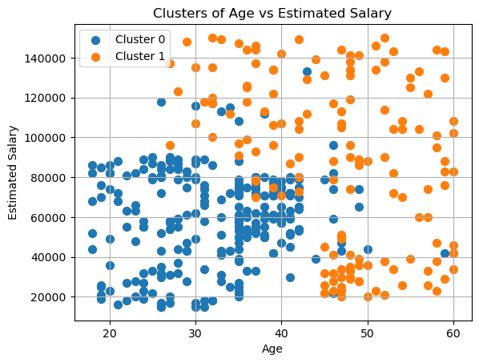

  - 해석
    - 연령이 20~30대이면서 임금이 20000~80000 의 집단과 이를 둘러싼 집단으로 나누어짐을 볼 수 있다. 중간 중간 섞여있는 부분이 보이지만 대체로 이렇게 구분되었음을 볼 수 있다.

- Purchased Plot

  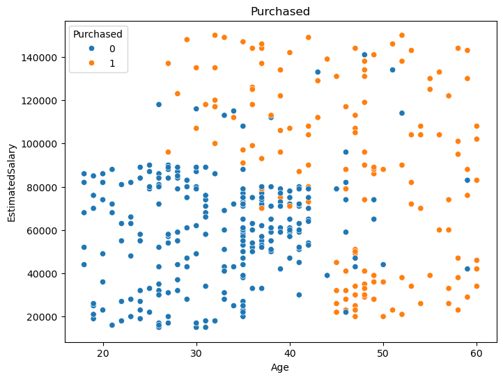

  - 해석
    - 실제 구매 분포에 대한 산점도를 그렸을 때 Kmeans plot과 집단의 분류는 비슷하다고 생각할 수 있다. 중간에 겹치는 부분까지 존재하는 것까지 유사함을 볼 수 있다.

- 실루엣 점수

  - Silhouette Score: 0.538
  - 실루엣 점수는 높지 않은 것을 볼 수 있는데 이는 모델에 대한 성능보다는 분류가 명확하지 않는 부분이 발생하여 생긴 문제라고 생각된다. 두 그룹 사이에 겹치는 부분이 발생했는데 그런 부분이 점수에 부정적인 영향을 주었을 것이라고 추정된다.

- **KaplanMeierFitter**

  - Age와 EstimatedSalary에 따라 구매 여부에 대한 생존 분석을 실시
  - 생존시간 : Age와 EstimatedSalary로 각각 지정하여 두번의 시각화 진행
  - 이벤트 발생 여부 : 구매여부
  - event_observed=E
  - EstimatedSalary vs. Purchased

    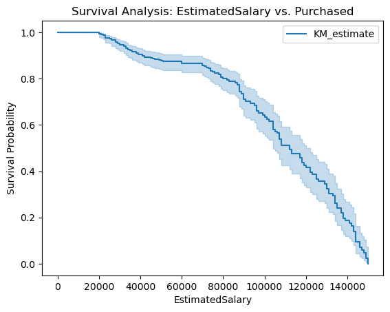

    - 해석
      - \$70000 정도에서 그래프의 기울기가 커짐을 확인할 수 있다.

  - Age vs. Purchased

    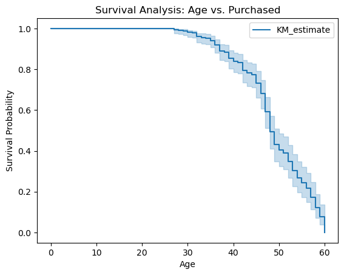

    - 40대 중반에서 기울기가 크게 감소함을 볼 수 있다.

  - 해석
    - Age와 EstimatedSalary가 연속형 자료이기는 하나 시계열적인 특징을 갖는다고 이야기하기는 어렵다. 처음 모델을 구상할 때 대소관계를 통해 시간적인 요소로 활용해보려고 했으나 구매여부에 큰 영향을 주는 Age와 EstimatedSalary가 독립적으로 영향을 주는 feature가 아니기에 생존분석에는 부적합하다고 판단. 그러나 기울기가 크게 변하는 구간(임금, 나이)은 앞선 분석과 어느정도 일치하는 것으로 보임

### 8. 결론

---

- 평가

  - 최종적으로 구매여부를 구분해주는 모델은 kmeans 클러스팅이 가장 적절하다고 생각함. 하지만 어떤 feature가 큰 영향을 주는지 확인하는 목적에서 RandomForestClassifier를 통해 적절한 feature을 통해 클러스터링을 했을때 더 성능이 좋을 것이라 예상. 즉 분류모델을 통해 feature을 확인하고 클러스터링을 하는 방법이 가장 적절하다고 생각했다.

- 해석

  - Sns 광고의 특성 : Sns 광고의 특성상 광고를 보았을 때 구매에 대한 충동성을 발생시키는 것이 중요하다고 생각. 원래 구매의사를 갖고 있지 않았지만 광고를 본 이후 충동적으로 구매를 하는 경우가 sns광고를 통해 구매를 하는 일반적인 경우인데 이에 영향을 주는 것은 제품을 홍보하는 광고자(인플루언서 등)일수도 있고 제품의 성능일 수도 있다.

  - 분석 결과 : 임금이 높은 30~40대, 또한 40대 중반에서 60대 정도는 임금에 대한 영향이 상대적으로 적게 구매한다는 것을 볼 수 있다. 10대나 20대는 거의 구매를 안한다고 할 수 있다. 나이와 임금을 독립적인 feature로 생각하기보다는 구매자의 특징을 복합적으로 결정짓는 요인으로 보아야 하는데 대체로 임금이 높거나 연령대가 높을 경우, 구매율이 높다는 경향이 있다는 결과를 볼 수 있다.

- 한계점

  - sns광고를 통해 판매되는 제품은 다양한 카테고리일 수 있는데 해당 데이터에서는 제품에 대한 정보가 없기 때문에 결과를 sns광고에 대한 일반적인 결과로 생각하기는 어렵다. 제품에 따라 선호하는 연령대가 다를 수 있기에 제품의 특성에 대한 부분이 추가적으로 필요할 것이다. 즉 해석에서 10대나 20대가 거의 구매를 안한다는 결론은 sns광고에 대해 그 연령대의 특징으로 단정짓기 어렵다.

- 추후 전략

  - 기존에 임금이 높고 연령대가 많은 그룹에 대해선 기존의 방식을 유지하되 광고를 보았을 때 충동성이 발생되기 유리한 집단으로 보고 제품의 성능을 강조하며 보다 고가의 제품을 판매해보는 전략을 도전해보면 좋을 것 같다. 반면 임금이 낮지만 젊은 그룹은 그들의 이목을 끌만한 전략이 필요한데 제품 자체를 홍보하기보다는 세대의 트렌드를 활용하거나 유명인을 활용하는 등 관심을 통해 충동성을 유발하는 전략이 필요하다고 생각이 든다.

### - 개선점

---

- 처음 연령대를 구분하고자 했을 때 10살 단위로 끊어 구분하려고 했지만 나이에 비해 현저히 떨어지는 영향을 준다는 결과를 볼 수 있었음. 연령대 별로 인원이 골고루 분포하지 않았기에 데이터 비율을 맞추고 나이 구간도 좀 더 명확히 나눠 집단을 세분화할 필요성을 느꼈다.

* ### 개발 환경
  - Python(v3.12.4)
  - Jupyter(v2024.7.0)
  - 라이브러리
    ```
    pandas version: 2.2.2
    numpy version: 1.26.4
    seaborn version: 0.13.2
    shap version: 0.46.0
    scikit-learn: 1.2.2
    sksurv: 0.18.0
    ```
